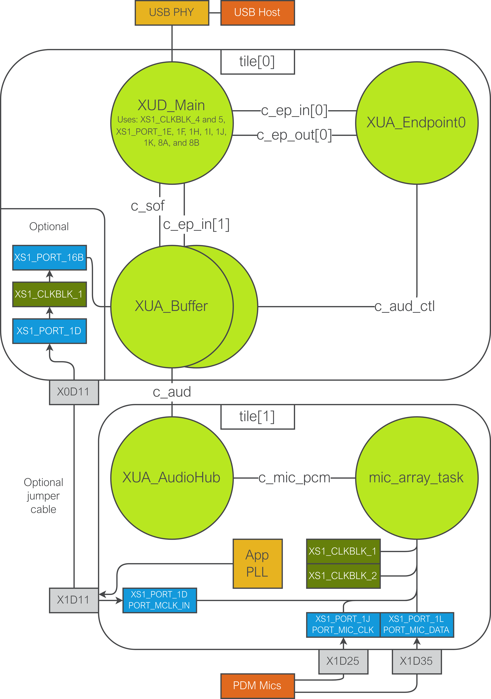
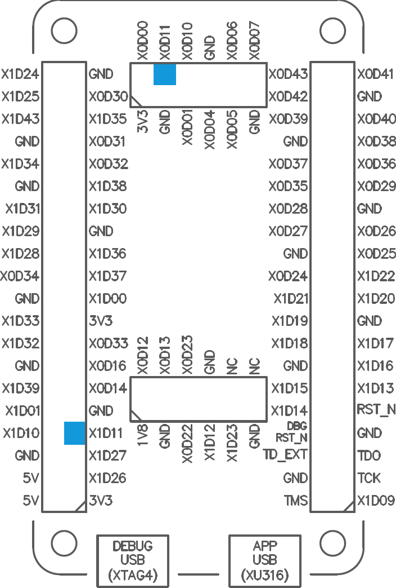

|newpage|

.. _sw_pdm_main:

PDM microphones
===============

``lib_xua`` is capable of integrating with PDM microphones.
The PDM stream from the microphones is converted to PCM and output to the host via USB.

Interfacing to the PDM microphones is done using the `XMOS` microphone array library
(`lib_mic_array <https://www.xmos.com/file/lib_mic_array>`_).
``lib_mic_array`` is designed to allow interfacing to PDM microphones coupled to efficient decimation filters
at a user configurable output sample rate. Currently dynamic sample rate changing is not supported.

.. note::
    The ``lib_mic_array`` library is only available for `xcore.ai` series devices since it uses the
    Vector Processing Unit of the XS3 architecture.

Up to eight PDM microphones can be attached the PDM interface (``mic_array_task()``) but it is
possible to extend this.

After PDM capture and decimation to the output sample-rate various other steps take place e.g. DC offset elimination etc. Please refer to the documentation provided with  ``lib_mic_array`` for further implementation detail and a complete feature set.

By default the sample rates supported are 16 kHz, 32 kHz and 48 kHz although other rates are supportable with some modifications.

Please see `AN00248 Using lib_xua with lib_mic_array <https://github.com/xmos/lib_xua/tree/develop/examples/AN00248_xua_example_pdm_mics>`_ for a practical example of this feature.

.. _sw_pdm_hardware:

Hardware characteristics
------------------------

The PDM microphones require a *clock input* and provide the PDM signal on a *data output*. All of
the PDM microphones must share the same clock signal (buffered on the PCB as appropriate), and
output onto the data wire(s) that are connected to the capture port. The lines required to interface
with PDM microphones are listed in :numref:`pdm_wire_table`.

.. _pdm_wire_table:

.. list-table:: PDM microphone data and signal wires
     :class: vertical-borders horizontal-borders
     :header-rows: 1

     * - Signal
       - Description
     * - CLOCK
       - The PDM clock the used by the microphones to drive the data out.
     * - DQ_PDM
       - The data from the PDM microphones on the capture port.

.. note::
    The clocking for PDM microphones may be single data rate (one microphone per pin) or double data rate (two microphones per pin clocking on alternate edges). By default ``lib_xua`` assumes double data rate which provides more efficient port usage.

No arguments are passed into ``lib_mic_array``. The library is configured statically using the following defines in ``xua_conf.h``:

   - ``MIC_ARRAY_CONFIG_PORT_MCLK`` - The port resource for the MCLK from which the PDM_CLK is derived. Normally XS1_PORT_1D on Tile[1].
   - ``MIC_ARRAY_CONFIG_PORT_PDM_CLK`` - The port resource which drives out the PDM clock.
   - ``MIC_ARRAY_CONFIG_PORT_PDM_DATA`` - The port used to receive PDM data. May be 1 bit, 4 bit or 8 bits wide.
   - ``MIC_ARRAY_CONFIG_CLOCK_BLOCK_A`` - The clock block used to generate the PDM clock signal.
   - ``MIC_ARRAY_CONFIG_CLOCK_BLOCK_B``  - The clock block used to capture the PDM data (Only needed if DDR is used).
   - ``XUA_PDM_MIC_FREQ``  - The output sample rate of lib_mic_array.

Optionally, the following defines may be overridden if needed:

   - ``MIC_ARRAY_CONFIG_MCLK_FREQ`` - The system MCLK frequency in Hz, usually set to XUA_PDM_MIC_FREQ.
   - ``MIC_ARRAY_CONFIG_PDM_FREQ`` - The PDM clock frequency in Hz. Usually set to 3072000.
   - ``MIC_ARRAY_CONFIG_USE_DC_ELIMINATION`` - Whether or not to run a DC elimination filter. Set to 1 by default.
   - ``MIC_ARRAY_CONFIG_USE_DDR`` - Whether or not to use Double Data Rate data capture on the PDM microphones. Set to 1 by default.

For full details of the effect of these defines please refer to the `lib_mic_array documentation <https://www.xmos.com/file/lib_mic_array>`_.

Usage & integration
-------------------

A PDM microphone wrapper is called from ``main()`` and takes one channel argument connecting it to the rest of the system:

    ``mic_array_task(c_pdm_pcm);``

The implementation of this function can be found in the file ``mic_array_task.c`` but it nominally takes one hardware thread.

Note, it is assumed that the system shares a global master-clock, therefore no additional buffering or rate-matching/conversion
is required. This ensures the PDM subsystem and XUA Audiohub are synchronous.

Two weak callback APIs are provided which optionally allow user code to be executed at startup (post PDM microphone initialisation) and after each sample frame is formed. These can be useful for custom hardware initialisation required by the PDM microphone or post processing such as gain control before samples are forwarded to XUA::

    void user_pdm_init();
    void user_pdm_process(int32_t mic_audio[MIC_ARRAY_CONFIG_MIC_COUNT]);

Be aware that ``user_pdm_process()`` is called in the main Audio Hub loop and so and processing should be kept very short to avoid breaking timing of I²S etc. Typically a small fraction of sample period is acceptable although the headroom is much larger at lower sample rates. The array of samples ``mic_audio`` can modified in-place.

Integration example
-------------------

A simple example showing the use of this feature on the Vision Development Kit
(XK-EVK-XU316-AIV) is provided in ``examples/app_xua_example_pdm_mics_vdk``.

The architecture diagram for this example is shown in :numref:`thread_pdm_vdk`.

.. _thread_pdm_vdk:

     ``app_xua_example_pdm_mics_vdk`` architecture diagram

Begin by configuring ``lib_xua`` via ``xua_conf.h``. First, the required
toolchain headers are imported, as shown in :numref:`pdm_mics_vdk_xua_conf_1`.
Importing ``xs1.h`` gives access to symbols such as the ``XS1_PORT_x`` macros,
while ``platform.h`` gives access to symbols defined in the .xn file, such as
``PORT_MCLK_IN``.

.. literalinclude:: ../../examples/app_xua_example_pdm_mics_vdk/src/xua_conf.h
     :language: c
     :name: pdm_mics_vdk_xua_conf_1
     :caption: Toolchain includes in ``xua_conf.h``
     :start-after: /*** Toolchain imports ***/
     :end-before: /*** IO config ***/

The IO settings are then configured in :numref:`pdm_mics_vdk_xua_conf_2`. The
correct number of USB audio channels (0 from host to device, 2 from device to
host) are set, and the number of I²S channels are set to 0. This means that
``lib_xua`` will not attempt to drive any I²S lines, reducing processor load and
memory usage. Finally, the tiles on which the USB device components and the
audio components are to run are specified. For this example, the USB device will
run from tile[0], while the audio IO will be located on tile[1].

.. note:: 
     The first four of these defines are required in order to compile XUA. 
     ``AUDIO_IO_TILE`` and ``XUD_TILE`` default to 0 if not set by the user.

.. literalinclude:: ../../examples/app_xua_example_pdm_mics_vdk/src/xua_conf.h
     :language: c
     :name: pdm_mics_vdk_xua_conf_2
     :caption: IO config in ``xua_conf.h``
     :start-after: /*** IO config ***/
     :end-before: /*** Clocking config ***/

The xcore.ai architecture includes an application PLL for generation of
arbitrary clock signals. This is pinned out on the device to pin X1D11, which
may be read from software on tile[1] on port ``XS1_PORT_1D``. In this example,
the application PLL is configured for use as a system master clock (MCLK) from
which the microphone PDM clock (and optionally the USB Asynchronous clock) may
be derived. The Vision Development Kit has four connectors (J2, J3, J4, and J5)
to which header pins may be soldered. This allows bridging pin X1D11 to a pin on
tile[0], which allows software on tile[0] to also read from the application PLL.
This example therefore supports two modes of operation: one where the
application PLL has been connected via a jumper cable to a pin on tile[0] (here
arbitrarily selected to be X0D11, accessed via ``XS1_PORT_1D`` on tile[0]), and
one where it has not. In the latter, the USB Asynchronous clock is driven by
tile[0]'s internal 100MHz reference clock.

To set up the former, connect the two header pins highlighted on the schematic
of the Vision Development Kit shown in :numref:`pdm_vdk_header`, and in the
CMakeLists.txt for this example append ``-DUSE_APP_PLL_TILE_0=1`` to the
``APP_COMPILER_FLAGS`` option.

.. note::
     Driving the USB clock from a different master clock than the microphones
     may result in instability over a long time period. While the ability to do
     so is demonstrated in this example, it is not a recommended mode of
     operation. The user is advised to, where facility is available, connect the
     application PLL to tile[0], as shown in :numref:`pdm_vdk_header`.

.. _pdm_vdk_header:

     Connection required to bridge the application PLL to tile[0] on the 
     Vision Development Kit for ``app_xua_example_pdm_mics_vdk``
     
The configuration in :numref:`pdm_mics_vdk_xua_conf_3` then sets up the required 
defines to achieve either mode of operation.

.. literalinclude:: ../../examples/app_xua_example_pdm_mics_vdk/src/xua_conf.h
     :language: c
     :name: pdm_mics_vdk_xua_conf_3
     :caption: Clocking config in ``xua_conf.h``
     :start-after: /*** Clocking config ***/
     :end-before: /*** Mic array config ***/

.. note:: 
     ``MCLK_441`` and ``MCLK_48`` are required in order to compile XUA. 
     ``XUA_USE_SW_PLL`` defaults to 1 if not set by the user.

The macros required for configuring ``lib_mic_array`` are then defined in
:numref:`pdm_mics_vdk_xua_conf_4`, as detailed :ref:`above<sw_pdm_hardware>`.

.. literalinclude:: ../../examples/app_xua_example_pdm_mics_vdk/src/xua_conf.h
     :language: c
     :name: pdm_mics_vdk_xua_conf_4
     :caption: Mic array config in ``xua_conf.h``
     :start-after: /*** Mic array config ***/
     :end-before: /*** XUA config ***/

Finally, other miscellaneous settings for XUA are then defined, including the 
desired audio class, vendor and product IDs, and whether or not to enable the
DFU interface. This is shown in :numref:`pdm_mics_vdk_xua_conf_5`.

.. literalinclude:: ../../examples/app_xua_example_pdm_mics_vdk/src/xua_conf.h
     :language: c
     :name: pdm_mics_vdk_xua_conf_5
     :caption: Other config in ``xua_conf.h``
     :start-after: /*** XUA config ***/
     :end-before: #endif

In ``src/main.xc``, the application is then constructed. Begin by including
necessary header files, as in :numref:`pdm_mics_vdk_main_1`.

.. note::
     ``lib_sw_pll`` is a C library, and must therefore be included from within
     an ``extern "C"`` block.

.. literalinclude:: ../../examples/app_xua_example_pdm_mics_vdk/src/main.xc
     :language: c
     :name: pdm_mics_vdk_main_1
     :caption: Application includes
     :start-after: /*** Includes ***/
     :end-before: /*** Global declarations ***/

Declarations then follow in :numref:`pdm_mics_vdk_main_2`. ``epTypeTable``\ s
are constructed for ``lib_xud``, detailing what transfer types are expected on
each Endpoint in use. Two Endpoints are defined in the In direction - a control
endpoint 0 and an isochronous endpoint for audio. A single control endpoint is
defined in the Out direction.

If the application PLL has been connected to a port on tile[0], the required
ports and clock blocks are then defined to allow the USB component to keep count
of the number of MCLK ticks on this port.

.. literalinclude:: ../../examples/app_xua_example_pdm_mics_vdk/src/main.xc
     :language: c
     :name: pdm_mics_vdk_main_2
     :caption: Global declarations
     :start-after: /*** Global declarations ***/
     :end-before: /*** User functions ***/

The weakly-declared function ``user_pdm_process`` is then defined in
:numref:`pdm_mics_vdk_main_3` to apply some gain to the microphone signals.

.. literalinclude:: ../../examples/app_xua_example_pdm_mics_vdk/src/main.xc
     :language: c
     :name: pdm_mics_vdk_main_3
     :caption: User functions
     :start-after: /*** User functions ***/
     :end-before: /*** Main ***/

Finally, the application is constructed in :numref:`pdm_mics_vdk_main_4` as per
the application diagram in :numref:`thread_pdm_vdk`. ``XUD_Main``,
``XUA_Endpoint0``, and ``XUA_Buffer`` are placed in parallel on tile[0]. Since
not many features of ``lib_xua`` are in use in this example, many parameters to
``XUA_Endpoint0`` may be nulled. If the application PLL is connected to tile[0],
the MCLK count port is set up and passed into ``XUA_Buffer`` - if left
unconnected, this parameter should be set to null.

On tile[1], ``XUA_AudioHub`` is instantiated. The call to this may null almost
every parameter - since the only IO component in use is the PDM microphones, all
that ``XUA_AudioHub`` requires is a channel from the ``mic_array_task`` and a
channel over which to send audio samples to ``XUA_Buffer``. In parallel, we
start the application PLL at a fixed frequency (512 * 48 kHz, or 24.576 MHz) and
then call ``mic_array_task``, which will set up ``lib_mic_array`` as configured
in ``xua_conf.h`` and then start producing samples. These are then sent to the
USB host by way of ``XUA_AudioHub``, ``XUA_Buffer``, and finally ``XUD_Main``.

.. literalinclude:: ../../examples/app_xua_example_pdm_mics_vdk/src/main.xc
     :language: c
     :name: pdm_mics_vdk_main_4
     :caption: Main
     :start-after: /*** Main ***/
